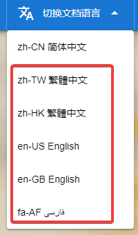
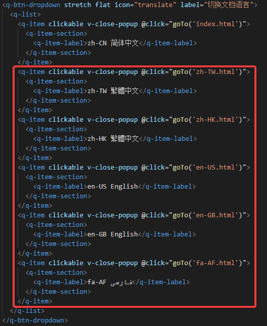

# octave_boost

The octave_boost package provides a comprehensive high performance processing
toolkit for GNU Octave, based on Boost C++ Libraries. It offers direct access
to Boost.Accumulators statistical accumulators for online computation of
count, covariance, density, error of mean, extended P^2 quantiles,
kurtosis, max/min, mean, median, moments, P^2 cumulative distribution,
P^2 quantile, peaks over threshold, POT quantile, POT tail mean,
skewness, sum, and tail statistics.

## Features

### Boost.Accumulators Statistical Accumulators

- **boost_accumulators_count**: Count the number of (non-NaN) elements
- **boost_accumulators_covariance**: Compute covariance between two variables
- **boost_accumulators_density**: Estimate probability density function
- **boost_accumulators_error_of_mean**: Compute standard error of the mean
- **boost_accumulators_extended_p_square**: Multiple quantile estimation (extended P^2)
- **boost_accumulators_extended_p_square_quantile_and_variants**: Quantile estimation with 4 variants
- **boost_accumulators_kurtosis**: Compute kurtosis (tailedness measure)
- **boost_accumulators_max**: Compute maximum value
- **boost_accumulators_mean_and_variants**: Mean, count, sum, weighted statistics
- **boost_accumulators_median_and_variants**: Median via 3 algorithms (P^2, density, CDF)
- **boost_accumulators_min**: Compute minimum value
- **boost_accumulators_moment**: Compute k-th moment (k=1..5)
- **boost_accumulators_p_square_cumulative_distribution**: P^2 cumulative distribution
- **boost_accumulators_p_square_quantile_and_variants**: P^2 quantile with weights
- **boost_accumulators_peaks_over_threshold_and_variants**: POT quantile and tail mean
- **boost_accumulators_pot_quantile_and_variants**: POT quantile estimation
- **boost_accumulators_pot_tail_mean**: POT tail mean (left and right tails)
- **boost_accumulators_skewness**: Compute skewness (asymmetry measure)
- **boost_accumulators_sum_and_variants**: Sum, Kahan-compensated sum, weighted sum
- **boost_accumulators_tail**: Extract largest/smallest N values

All functions skip NaN values automatically and support both row and column vectors as well as matrices.

## Documentation

Check out document: [octave_boost Document](https://cnoctave.github.io/octave_boost/index.html)

## Installation

### Prerequisites
- GNU Octave (>= 8.0.0)
- Boost C++ development headers (Boost.Accumulators is header-only, no compiled library needed)

### Build from source
```bash
# Clone the repository
git clone https://github.com/CNOCTAVE/octave_boost.git
cd octave_boost

# Build the package
cd src
./configure
make

# Install in Octave
octave --eval "pkg install .."
```

### Install directly in Octave
```octave
pkg install https://github.com/CNOCTAVE/octave_boost/archive/main.tar.gz
```

## Quick Start

```octave
% Load the package
pkg load octave_boost

% Basic statistics
data = randn (1000, 1);
cnt = boost_accumulators_count (data);
m = boost_accumulators_max (data);
mn = boost_accumulators_min (data);

% Mean and variants
res = boost_accumulators_mean_and_variants (data);
printf ("mean = %f, count = %d, sum = %f\n", res.mean, res.count, res.sum);

% Skewness and kurtosis
s = boost_accumulators_skewness ([2, 7, 4, 9, 3]);
k = boost_accumulators_kurtosis ([2, 7, 4, 9, 3]);

% Quantile estimation
q = boost_accumulators_p_square_quantile_and_variants (data, 0.5);
printf ("median = %f\n", q.quantile);

% Density estimation
d = boost_accumulators_density (data);

% Covariance
c = boost_accumulators_covariance ([1, 2; 1, 4; 2, 3; 6, 1]);

% Run the full demo
demo_boost_accumulators ();
```

## Package Structure
```
octave_boost/
├── src/          # C++ source files (.cc) — Octave loadable functions (DEFUN_DLD)
├── inst/         # Octave function files (.m)
├── docs/         # Documentation (zh-CN, multi-language support)
├── .github/      # GitHub Actions CI workflow
├── DESCRIPTION   # Package metadata
├── INDEX         # Function categories
└── NEWS          # Version history
```

## License
GNU General Public License v3.0 or later (GPLv3+)

## Citation
If you use octave_boost in academic research, please cite:

```
@misc{CNOCTAVE2024,
  author = {Yu Hongbo},
  title = {octave_boost},
  year = {2024},
  howpublished = {\url{https://github.com/CNOCTAVE/octave_boost}}
}
```

## How to translate octave_boost Document into another language
In ./docs directory, index.html is zh-CN simplified Chinese document.
For example, if you want to translate document into English.
1. Copy index.html as another document with different language code as filename,
   for example, en-US.html.
2. Translate en-US.html into English.
3. Add dropdown like the picture below to every *.html.
   For example, add dropdown "en-US English".
   
   The code for adding dropdown is like the picture below.
   
4. PR to octave_boost.
